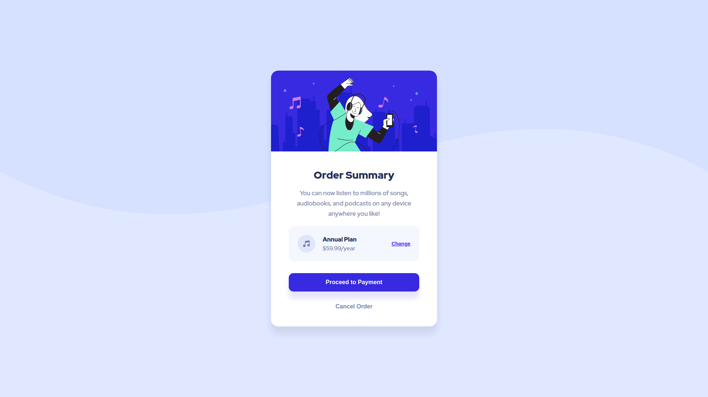

# Frontend Mentor - Order summary card solution

This is a solution to the [Order summary card challenge on Frontend Mentor](https://www.frontendmentor.io/challenges/order-summary-component-QlPmajDUj). Frontend Mentor challenges help you improve your coding skills by building realistic projects. 

## Table of contents

- [Overview](#overview)
  - [The challenge](#the-challenge)
  - [Screenshot](#screenshot)
  - [Links](#links)
- [My process](#my-process)
  - [Built with](#built-with)
  - [What I learned](#what-i-learned)
  - [Useful resources](#useful-resources)
- [Author](#author)

## Overview

### The challenge

Users should be able to:

- See hover states for interactive elements

### Screenshot



### Links

- Solution URL: [Github repo](https://github.com/hamilton-i7/order_summary_component)
- Live Site URL: [Visit solution](https://order-summary-component-lac.vercel.app/)

## My process

### Built with

- Semantic HTML5 markup
- CSS custom properties
- Flexbox
- Mobile-first workflow

### What I learned

It was for the most part a review. Just going through some topics I've already learned previously but have forgotten due to months without pracitce.
Something I didn't know up until now, is that text-decoration is not a property affected by transition, so I had to use text-decoration-color instead.
```scss
    &__cta {
        @include text-button();

        color: $accent-color-1;   
        text-decoration: underline;     
        text-decoration-color: $accent-color-1;
        transition: all 200ms ease-in-out;
        transition-property: color, text-decoration-color;

        &:hover {
            color: rgba($color: $accent-color-1, $alpha: 0.7);
            text-decoration-color: transparent;
        }
    }
```

### Useful resources

- [text-decoration-color transition](https://stackoverflow.com/questions/30352431/css-transition-not-working-with-underline) - This helped me solve the link underline transition problem.

## Author

- Website - [Juan Hamilton](https://github.com/hamilton-i7)
- Frontend Mentor - [@hamilton-i7](https://www.frontendmentor.io/profile/hamilton-i7)